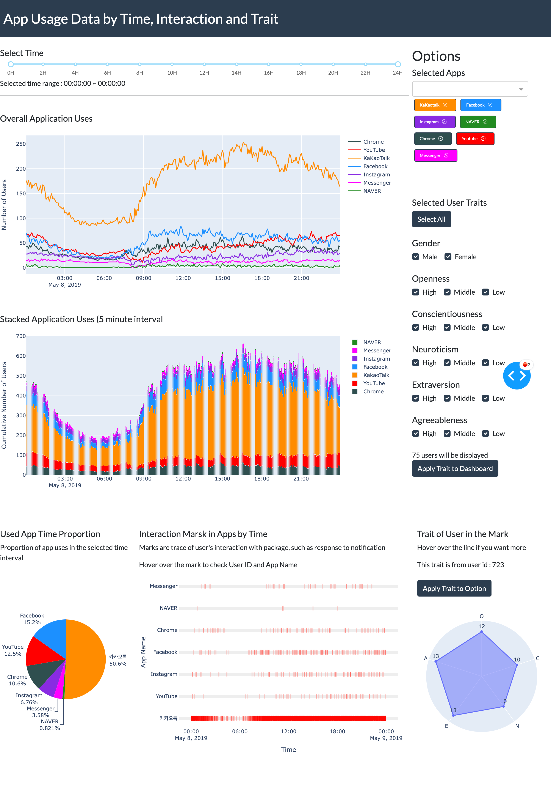

# DV-Final
This work is for the design project of CS492 Data Visualization class in KAIST by team 6: SOJUJU. We built a dashboard using smartphone usage dataset, for visualized insights to figure out which SNS platform fits for advertisements targeting certain users.
### Goal
* Want some logical data-driven insights to improve advertising impacts
* Want easily visualized results to persuade and communicate with investors

### Target Users
* User who are working at a small company and seeking advertisement optimization

### Tasks
* User check the target SNS application and target user traits.
* User set the time to target the application usage and the number of users
* User check detail interaction events with packages(i.e. notification interaction).
* Based on the insights obtained by tracking the characteristics of application users and the time zone of interaction, iterate application and user trait filtering so that additional data can be explored.

### Page Image
